# Azure Digital Twins Hands On Lab

## Overview

Suppose you work at a Chocolate Manufacturing Factory as Technical Specialist to support The Chocolate Factory line operators. You are commissioned to launch a new near real-time dashboard to support operators monitor running operations for the Fanning/Roasting, Grinding and Moulding processes to answer questions such as: 
•	find all time windows when temperature during roasting is >150°F in the previous 24 hours and trace back events in ADT leading to that
•	Calculate the average Grinding vibration in the last 2 minutes to ensure the process meets manufacturing quality standards
•	Find all incidents with unusually higher than normal molding temperature in the previous 5 days

Also, you may need to gather historical data that can be used for postmortem root-cause analysis when all operations fail, correct the problem and set up a better notification system for these incidents.
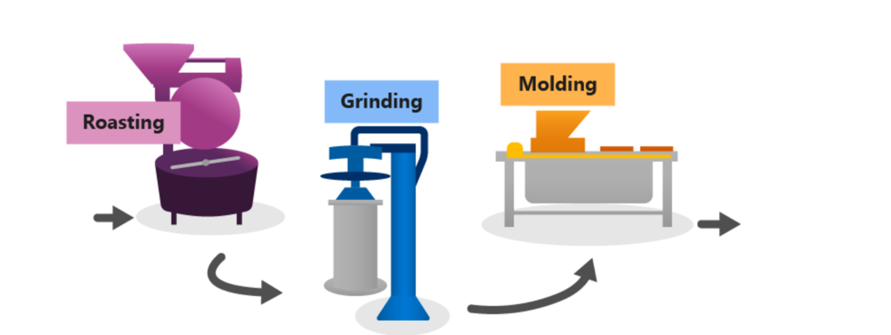

## Architecture

In this HOL, you will be setting up the end-to-end-architecture below.
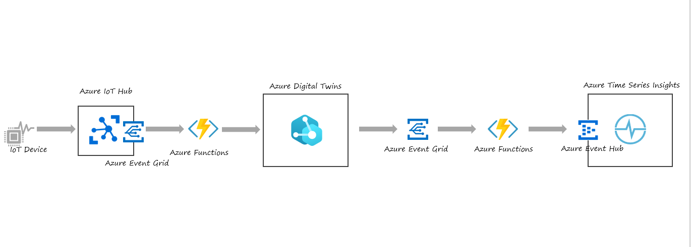

## Prerequisites

- Azure Subcription
- Admin Access to Azure AD Tenant & Azure Subscription
- Mac OS: [PowerShell for Mac](https://docs.microsoft.com/en-us/powershell/scripting/install/installing-powershell-core-on-macos?view=powershell-6 )
- Windows OS: PowerShell is built-in
- [Azure Command Line Interface (CLI)](https://docs.microsoft.com/en-us/cli/azure/install-azure-cli)
    - Recommend installing AZ CLI locally
    - Do not recommend using the Azure Cloud Shell as it will timeout due to the length of the lab
- [.NET Core 3.1](https://dotnet.microsoft.com/download)
- [Visual Studio Code](https://code.visualstudio.com)
- [C# VS Code extension](https://marketplace.visualstudio.com/items?itemName=ms-dotnettools.csharp)
- [Azure Function VS Code extension](https://marketplace.visualstudio.com/items?itemName=ms-azuretools.vscode-azurefunctions)
- [Node.js](https://nodejs.org/en/download/)
- [Git](https://git-scm.com/downloads)

## Lab Setup

### Setup Variables

First, we'll need to create and store some variables. This will make running the commands needed in the subsequent steps easier and avoid mistakes from typos.

1. If you're using the Azure Cloud Shell (not recommended) make sure the CLI is set to **Powershell**
1. If you're on your local machine, open a PowerShell console
1. Log into Azure

```azurecli
az login
```

- Ensure you are logged into the right account and set to the correct default Azure subscription by running the command below
    ```azurecli
    az account show
    ```
- You can change the subscription using the command below
    ```azurecli
    az account set -s <subscriptionId>
    ```
1. Edit the below as needed then copy and paste the following into the Powershell window

```azurecli
$rgname = "adtholrg"+ $(get-random -maximum 10000)
$random = "adthol" + $(get-random -maximum 10000)
$dtname = $random + "-digitaltwin"
$location = "eastus"
$username = Read-Host "Enter username. ex: jdoe@contoso.com"
$functionstorage = $random + "storage"
$telemetryfunctionname = $random + "-telemetryfunction"
$twinupdatefunctionname = $random + "-twinupdatefunction"

#!!This command will fail for OCP Bootcamp participants since group already exists
az group create -n $rgname -l $location

$rgname
$dtname
$location
$username
$telemetryfunctionname
$twinupdatefunctionname
$functionstorage
```
> [!NOTE]
>
>Save these values for use later in notepad or another similar tool

## Clone GitHub Repo

1. Create a directory and clone the repo. Replace *username* with a valid directory

    ```azurecli
    mkdir c:\users\username\repos
    cd c:\users\username\repos
    git clone https://github.com/Azure-Samples/digital-twins-samples/
    ```

## Use the CLI to deploy ADT

1. Create Azure Digital Twins

    ```azurecli
   az dt create --dt-name $dtname -g $rgname -l $location
    ```
>[!NOTE]
>If it's your first time running the az dt command, you'll be prompted to add the extension. Choose 'Y'
>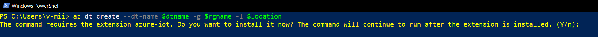

1. In order to modify the Azure Digital Twins service, you'll need to assign the *Azure Digital Twins Owner* permission

    ```azurecli
    az dt role-assignment create -n $dtname -g $rgname --role "Azure Digital Twins Data Owner" --assignee $username -o json
    ```
### Collect instance values

>[!NOTE]
> Save these outputs below to notepad for use later
>
1. Get the hostname of the Digital Twins instance. Copy the output to notepad for use later.

    ```azurecli
    az dt show -n $dtname --query 'hostName'
    ```

### Collect Azure AD tenant values

1. Get the Azure Active Directory (AAD) Tennant ID

    ```azurecli
    az account show --query 'tenantId'
    ```

## Azure Digital Twin Modeling

A simple ADT model looks like the example below.

```JSON
{
  "@id": "dtmi:contosocom:DigitalTwins:Thermostat;1",
  "@type": "Interface",
  "@context": "dtmi:dtdl:context;2",
  "contents": [
    {
      "@type": "Property",
      "name": "Temperature",
      "schema": "double"
    }
  ]
}
```

For this exercise we will be simulating a factory which requires much more complex model.  The models we'll be using are in the digital-twins-samples/HandsOnLab/models folder:

- FactoryInterface.json
- FactoryFloorInterface.json
- ProductionLineInterface.json
- ProductionStepInterface.json
- ProductionStepGrinding.json

## Setup ADT Models

Upload these model to your twins instance by running following the steps below

1. Navigate to the folder where the models are stored and upload the models:

    ```azurecli
    cd C:\Users\username\repos\digital-twins-samples\handsonlab\models
    $factorymodelid = $(az dt model create -n $dtname --models .\FactoryInterface.json --query [].id -o tsv)
    $floormodelid = $(az dt model create -n $dtname --models .\FactoryFloorInterface.json --query [].id -o tsv)
    $prodlinemodelid = $(az dt model create -n $dtname --models .\ProductionLineInterface.json --query [].id -o tsv)
    $prodstepmodelid = $(az dt model create -n $dtname --models .\ProductionStepInterface.json --query [].id -o tsv)
    $gridingstepmodelid = $(az dt model create -n $dtname --models .\ProductionStepGrinding.json --query [].id -o tsv)
    ```

1. Once the models are successfully uploaded, use the following commands to create Twin instances

    ```azurecli
    az dt twin create -n $dtname --dtmi $factorymodelid --twin-id "ChocolateFactory"
    az dt twin create -n $dtname --dtmi $floormodelid --twin-id "FactoryFloor"
    az dt twin create -n $dtname --dtmi $prodlinemodelid --twin-id "ProductionLine"
    az dt twin create -n $dtname --dtmi $gridingstepmodelid --twin-id "GrindingStep"
    ```

1. Next we'll need to establish how the models relate to each other. To setup the relationships between twin instances, we must identify the relationship definitions in the models (.json documents) that were uploaded.  In the case of the Factory Interface / Chocolate Factory, the relationship name is "rel_has_floors"

    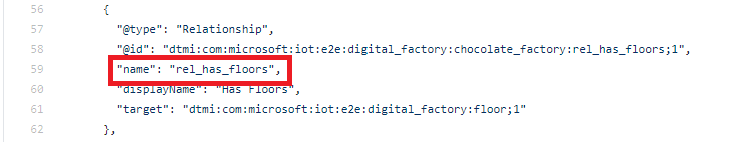

1. Now that we know the relationship that we want to establish, run the commands below to instantiate the relationships.

    ```azurecli
    $relname = "rel_has_floors"
    az dt twin relationship create -n $dtname --relationship $relname --twin-id "ChocolateFactory" --target "FactoryFloor" --relationship-id "Factory has floors"
    $relname = "rel_runs_lines"
    az dt twin relationship create -n $dtname --relationship $relname --twin-id "FactoryFloor" --target "ProductionLine" --relationship-id "Floor run production lines"
    $relname = "rel_runs_steps"
    az dt twin relationship create -n $dtname --relationship $relname --twin-id "ProductionLine" --target "GrindingStep" --relationship-id "Floor run production lines"
    ```

You now have an Azure Digital Twin of a factory production line! You can view your DT using a tool like [ADT Explorer](https://docs.microsoft.com/en-us/samples/azure-samples/digital-twins-explorer/digital-twins-explorer/). ADT explorer also provides additional Twin Capabilities like uploading models, creating twins, relationship, and updating twin properties.

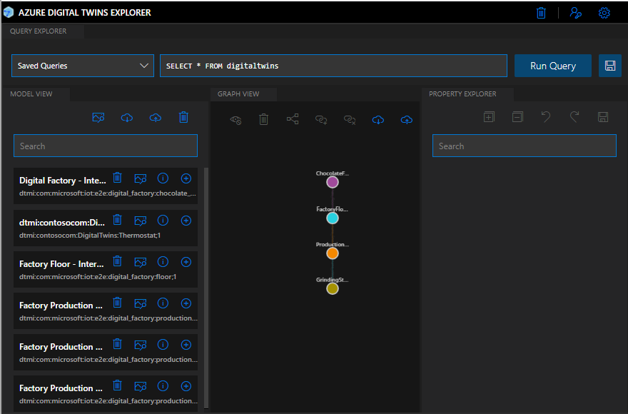

### Challenge: ADT Modeling

To meet the goal stated at the beginning of this lab, our digital twin will need models and instances of Roasting and Molding.

After this lab is complete, try and add the other twin models and instances and relationships.

- ProductionStepMoulding.json
- ProductionStepFanning.json

## Setup Function to Ingest Events from IoT Hub

We can ingest data into Azure Digital Twins through external compute resources, such as an Azure Function, that receives the data and uses the Digital Twins SDK to set properties.

### Create an Azure Function via CLI

1. Create a Azure storage account

    ```azurecli
    az storage account create --name $functionstorage --location $location --resource-group $rgname --sku Standard_LRS
    ```

1. Create an Azure Function

    ```azurecli
    az functionapp create --resource-group $rgname --consumption-plan-location $location --name $telemetryfunctionname --storage-account $functionstorage --functions-version 3
    ```

### Configure security access for the Azure function app

An Azure function requires a security token in order to authenticate with Azure Digital Twins. To make sure that this token is passed, you'll need to create a [Managed Service Identity (MSI)](../active-directory/managed-identities-azure-resources/overview.md) for the function app.

In this section, we'll create a system-managed identity and assign the function app's identity to the *Azure Digital Twins Data Owner* role for your Azure Digital Twins instance. The Managed Identity gives the function app permission in the instance to perform data plane activities. We'll also provide the the URL of Azure Digital Twins instance to the function by setting an environment variable.

1. Use the following command to create the system-managed identity. We'll also store the _principalId_ field in the a variable for use later.

    ```azurecli
    $principalID = $(az functionapp identity assign -g $rgname -n $telemetryfunctionname  --query principalId)
    ```

1. Use the _principalId_ value in the following command to assign the function app's identity to the _Azure Digital Twins Data Owner_ role for your Azure Digital Twins instance.

    ```azurecli	
    az dt role-assignment create --dt-name $dtname --assignee $principalID --role "Azure Digital Twins Data Owner"
    ```

1. Lastly, set the URL of your Azure Digital Twins as an environment variable

> [!TIP]
> The Azure Digital Twins instance's URL is made by adding *https://* to the beginning of your Azure Digital Twins instance's *hostName* which you retrieved earlier.
> You'll need to edit the command below in notepad and add the FULL url before pasting

```azurecli
   az functionapp config appsettings set -g $rgname -n $telemetryfunctionname --settings "ADT_SERVICE_URL=https://<your-Azure-Digital-Twins-instance-hostname>"
```

### Create an Azure Functions app in Visual Studio Code

In this section, you use Visual Studio Code to create a local Azure Functions project in your chosen language. The function will be triggered by EventGrid.

1. Ensure you are signed into Azure using the correct account by examining the logon at the lower-right
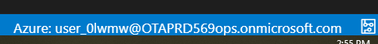
- If you need to change your account:
    - Bring up the VS Code command pallet(Ctrl+Shift+P) and enter Azure: Sign out
    - Then run Azure: Sign in
    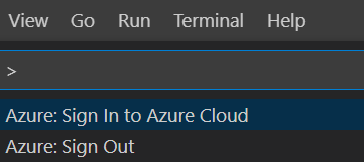

1. Choose the Azure icon in the Activity bar, then in the **Azure: Functions** area, select the **Create new project...** icon.

    

1. Choose a directory location for your project workspace and choose **Select**.

>[!NOTE]
>This directoy should be new, empty, and unique for this Azure Function
>

1. Provide the following information at the prompts:
    - **Select a language for your function project**: Choose `C#`.
    - **Select a template for your project's first function**: Choose `Change template filter`.
    - **Select a template filter**: Choose All
    - **Select a template for your project's first function**: Choose `EventGridTrigger`.
    - **Provide a function name**: Type `TwinsFunction`.
    - **Provide a namespace**: Type `My.Function`.
    - **When prompted for a storage account choose**: Skip for now
    - **Select how you would like to open your project**: Choose `Add to workspace`.

### Install Nuget packages

In the Visual Studio Code Terminal, add the required Nuget packages by typing the following commands:

```dos
    dotnet add package Azure.DigitalTwins.Core --version 1.0.0
    dotnet add package Azure.identity --version 1.2.2
    dotnet add package System.Net.Http
```

### Write an Azure function with an Event Grid trigger

Now we'll add code that uses the ADT SDK to update a digital twin.

1. In VS Code, open the file TwinsFunction.cs
1. Replace the code in the Function App template with the sample provided:

>[!TIP]
>The namespace and function name must match.  If you changed them in the previous steps, make sure to do the same in the code sample.

```csharp
using Azure;
using Azure.Core.Pipeline;
using Azure.DigitalTwins.Core;
using Azure.Identity;
using Microsoft.Azure.EventGrid.Models;
using Microsoft.Azure.WebJobs;
using Microsoft.Azure.WebJobs.Extensions.EventGrid;
using Microsoft.Extensions.Logging;
using Newtonsoft.Json;
using Newtonsoft.Json.Linq;
using System;
using System.Net.Http;

namespace My.Function
{

    public class TwinsFunction
    {
        //Your Digital Twin URL is stored in an application setting in Azure Functions
        private static readonly string adtInstanceUrl = Environment.GetEnvironmentVariable("ADT_SERVICE_URL");
        private static readonly HttpClient httpClient = new HttpClient();

        [FunctionName("TwinsFunction")]
        public async void Run([EventGridTrigger] EventGridEvent eventGridEvent, ILogger log)
        {
            log.LogInformation(eventGridEvent.Data.ToString());
            if (adtInstanceUrl == null) log.LogError("Application setting \"ADT_SERVICE_URL\" not set");
            try
            {
                //Authenticate with Digital Twins
                ManagedIdentityCredential cred = new ManagedIdentityCredential("https://digitaltwins.azure.net");
                DigitalTwinsClient client = new DigitalTwinsClient(new Uri(adtInstanceUrl), cred, new DigitalTwinsClientOptions { Transport = new HttpClientTransport(httpClient) });
                log.LogInformation($"ADT service client connection created.");
                if (eventGridEvent != null && eventGridEvent.Data != null)
                {
                    log.LogInformation(eventGridEvent.Data.ToString());

                    // Reading deviceId and temperature for IoT Hub JSON
                    JObject deviceMessage = (JObject)JsonConvert.DeserializeObject(eventGridEvent.Data.ToString());
                    string deviceId = (string)deviceMessage["systemProperties"]["iothub-connection-device-id"];
                    string deviceType = (string)deviceMessage["body"]["DeviceType"];
                    log.LogInformation($"Device:{deviceId} DeviceType is:{deviceType}");
                     var updateTwinData = new JsonPatchDocument();
                    switch (deviceType){
                        case "FanningSensor":
                            updateTwinData.AppendAdd("/ChasisTemperature", deviceMessage["body"]["ChasisTemperature"].Value<double>());
                            updateTwinData.AppendAdd("/FanSpeed", deviceMessage["body"]["Force"].Value<double>());
                            updateTwinData.AppendAdd("/RoastingTime", deviceMessage["body"]["RoastingTime"].Value<int>());
                            updateTwinData.AppendAdd("/PowerUsage", deviceMessage["body"]["PowerUsage"].Value<double>());
                            await client.UpdateDigitalTwinAsync(deviceId, updateTwinData);
                        break;
                        case "GrindingSensor":
                            updateTwinData.AppendAdd("/ChasisTemperature", deviceMessage["body"]["ChasisTemperature"].Value<double>());
                            updateTwinData.AppendAdd("/Force", deviceMessage["body"]["Force"].Value<double>());
                            updateTwinData.AppendAdd("/PowerUsage", deviceMessage["body"]["PowerUsage"].Value<double>());
                            updateTwinData.AppendAdd("/Vibration", deviceMessage["body"]["Vibration"].Value<double>());
                            await client.UpdateDigitalTwinAsync(deviceId, updateTwinData);
                        break;
                        case "MouldingSensor":
                            updateTwinData.AppendAdd("/ChasisTemperature", deviceMessage["body"]["ChasisTemperature"].Value<double>());
                            updateTwinData.AppendAdd("/PowerUsage", deviceMessage["body"]["PowerUsage"].Value<double>());
                            await client.UpdateDigitalTwinAsync(deviceId, updateTwinData);
                        break;
                    }

                }
            }
            catch (Exception e)
            {
                log.LogError(e.Message);
            }

        }
    }

}
```

### Publish the function app to Azure

1. In the VSCode function extension, click on on **Deploy to Function App...**

    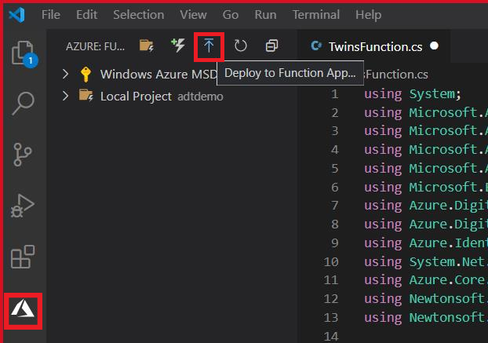

- **Select subscription**: Choose `Concierge Subscription` if you're using the sandbox environment
- **Select Function App in Azure**: Choose the function ending with `telemetryfunction`.

1. When the deployment finishes, you'll be prompted to Start Streaming Logs
  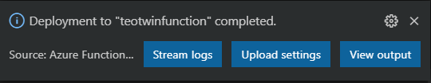
1. Click on **Stream Logs** to see the messages received by the Azure Function after the IoT Hub setup in the next step. There won't be any messages received until the IoT Hub is setup and a device sends messages.
1. When prompted to *enable appication logging*, choose Yes.
    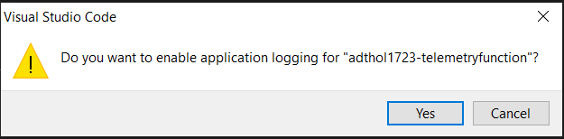
1. Alternatively, you can Stream Logs at a later time by right-clicking on the Azure Function in VS Code and choosing **Start Streaming Logs**
  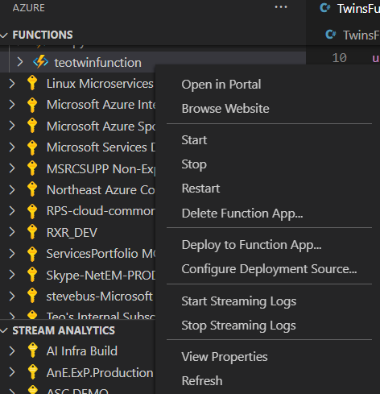
  
## Setup IoT Hub

The data our Digital Twin needs comes from IoT devices that send their data to IoT Hub.  In this section, we'll create an IoT Hub and configure it to publish device telemetry to EventGrid.

1. Run the following [command to create an IoT hub](https://docs.microsoft.com/cli/azure/iot/hub#az-iot-hub-create) in your resource group, using a globally unique name for your IoT hub:

   ```azurecli-interactive
   az iot hub create --name $dtname --resource-group $rgname --sku S1 -l $location
   ```

1. Create a device identity in IoT Hub with the following command.

> [!Note] The Azure Function assumes the --device-id matches the --twin-id created when a Twin is initialized.
    
```azurecli
az iot hub device-identity create --device-id GrindingStep --hub-name $dtname -g $rgname
az iot hub device-identity connection-string show -d GrindingStep --hub-name $dtname
```

The output is information about the device that was created. Copy the device connection string for use later.

### Configure EventGrid for IoT Hub

In this section, you configure your IoT Hub to publish events as they occur.

1. Configure IoT Hub to publish events to EventGrid

```Azure CLI
$iothub=$(az iot hub list -g $rgname --query [].id -o tsv)
$function=$(az functionapp function show -n $telemetryfunctionname -g $rgname --function-name twinsfunction --query id -o tsv)
az eventgrid event-subscription create --name IoTHubEvents --source-resource-id $iothub --endpoint $function --endpoint-type azurefunction --included-event-types Microsoft.Devices.DeviceTelemetry
```
### Send data from a simulated device

1. Open the file ~\digital-twins-samples\HandsOnLab\SimulatedClient\Sensor.js
1. Find the line **const deviceConnectionString = ""** and update it with the device connection string created earlier.

>[!NOTE]
>if you lost the device connection string, you can retrieve it by running the command:
> az iot hub device-identity connection-string show -d GrindingStep --hub-name $dtname -o tsv

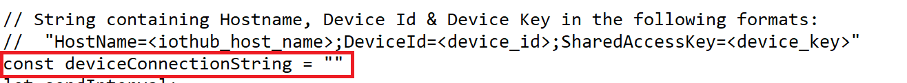

1. In a **new** PowerShell window, navigate to the SimulatedClient folder in the repo and run the simulated client.  **Leave the client running**

    ```Azure CLI
    cd C:\Users\username\repos\digital-twins-samples\handsonlab\SimulatedClient
    npm install
    node ./Sensor.js
    ```

1. The simulated device will begin sending data. Leave this running.

At this point, you should see messages showing up in the Azure Function Log Stream that was configured previously.  The Azure Function Log Stream will show the telemetry being received from Event Grid and any errors connecting to Azure Digital Twins or updating the Twin.

   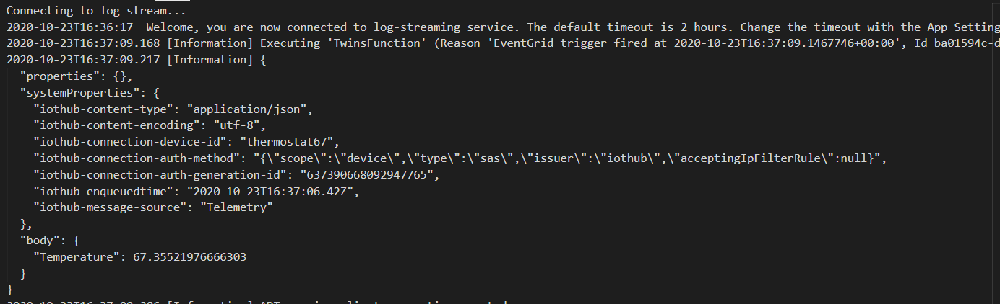

### Validate Azure Digital Twin is receiving data

1. Look at the values in being updated in the Twin GrindingSensor by running the following command

    ```azurecli
     az dt twin show -n $dtname --twin-id GrindingStep
    ```

### Challenge: Simulate Fanning / Roasting and Moulding devices

The Sensor.js file can be changed to send data as additional devices. The Azure Function has logic that evaluates the device type specified in the payload.  Change the value stored in deviceType and deviceConection string to send as Fanning and Moulding sensors.


> [!NOTE] Remember that the Azure Function assumes the --device-id matches the --twin-id created when a Twin is initialized.

## Configure Azure Digital Twin to route data to other environments

ADT supports sending information about changes to ADT to external systems through ADT routes. In the following section, we'll configure ADT to send data to Event Hubs to be processed by an Azure Function.

### Create Event Hubs

1. Create two (2) event hubs.

    ```azurecli
    $ehnamespace = $dtname + "ehnamespace"
    az eventhubs namespace create --name $ehnamespace --resource-group $rgname -l $location
    az eventhubs eventhub create --name "twins-event-hub" --resource-group $rgname --namespace-name $ehnamespace
    az eventhubs eventhub create --name "tsi-event-hub" --resource-group $rgname --namespace-name $ehnamespace
    az eventhubs eventhub authorization-rule create --rights Listen Send --resource-group $rgname --namespace-name $ehnamespace --eventhub-name "twins-event-hub" --name EHPolicy
    az eventhubs eventhub authorization-rule create --rights Listen Send --resource-group $rgname --namespace-name $ehnamespace --eventhub-name "tsi-event-hub" --name EHPolicy
    ```

### Create  ADT Route

1. Create an ADT endpoint

    ```azurecli
    az dt endpoint create eventhub --endpoint-name EHEndpoint --eventhub-resource-group $rgname --eventhub-namespace $ehnamespace --eventhub "twins-event-hub" --eventhub-policy EHPolicy -n $dtname
    ```

1. Create an ADT route

    ```azurecli
    az dt route create -n $dtname --endpoint-name EHEndpoint --route-name EHRoute --filter "type = 'Microsoft.DigitalTwins.Twin.Update'"
    ```

### Create Azure Function

1. Create an Azure Function

    ```azurecli
        az functionapp create --resource-group $rgname --consumption-plan-location $location --runtime dotnet --functions-version 3 --name $twinupdatefunctionname --storage-account  $functionstorage
      ```

1. Add application config that stores the connection strings needed by the Azure Function

    ```azurecli
    $adtehconnectionstring=$(az eventhubs eventhub authorization-rule keys list --resource-group $rgname --namespace-name $ehnamespace --eventhub-name twins-event-hub --name EHPolicy --query primaryConnectionString -o tsv)
    $tsiehconnectionstring=$(az eventhubs eventhub authorization-rule keys list --resource-group $rgname --namespace-name $ehnamespace --eventhub-name tsi-event-hub --name EHPolicy --query primaryConnectionString -o tsv)
    az functionapp config appsettings set --settings "EventHubAppSetting-Twins=$adtehconnectionstring" -g $rgname -n $twinupdatefunctionname
    az functionapp config appsettings set --settings "EventHubAppSetting-TSI=$tsiehconnectionstring" -g $rgname -n $twinupdatefunctionname
    ```

### Create an Azure Functions app in Visual Studio Code for Event Hub

Use Visual Studio Code to create a local Azure Functions project. Later in this article, you'll publish your function code to Azure.

1. Choose the Azure icon in the Activity bar, then in the **Azure: Functions** area, select the **Create new project...** icon.

    

1. Choose a directory location for your project workspace and choose **Select**.

>[!NOTE]
>This directoy should be new, empty, and unique for this Azure Function
>

1. Provide the following information at the prompts:
    - **Select a language for your function project**: Choose `C#`.
    - **Select a template for your project's first function**: Choose `EventHubTrigger`.
    - **Provide a function name**: Type `TSIFunction`.
    - **Provide a namespace**: Type `TSIFunctionsApp`.
    - **Select setting from local.settings.json**: Hit Enter
    - **Select subscription**: Select the subscription you're using
    - **Select an event hub namespace**: Choose the eventhub namespace that begins with `adthol`
    - **Select an event hub**: Choose `twins-event-hub`
    - **Select an event hub policy**: Choose `EHPolicy`
    - **When prompted for a storage account choose**: Skip for now
    - **Select how you would like to open your project**: Choose `Add to workspace`.
1. Open the file TSIFunction.cs
1. Replace the code with the code sample below.

```C#
using Microsoft.Azure.EventHubs;
using Microsoft.Azure.WebJobs;
using Microsoft.Extensions.Logging;
using Newtonsoft.Json;
using Newtonsoft.Json.Linq;
using System.Threading.Tasks;
using System.Text;
using System.Collections.Generic;

namespace TSIFunctionsApp
{
    public static class ProcessDTUpdatetoTSI
    { 
        [FunctionName("ProcessDTUpdatetoTSI")]
        public static async Task Run(
            [EventHubTrigger("twins-event-hub", Connection = "EventHubAppSetting-Twins")]EventData myEventHubMessage, 
            [EventHub("tsi-event-hub", Connection = "EventHubAppSetting-TSI")]IAsyncCollector<string> outputEvents, 
            ILogger log)
        {
            JObject message = (JObject)JsonConvert.DeserializeObject(Encoding.UTF8.GetString(myEventHubMessage.Body));
            log.LogInformation("Reading event:" + message.ToString());

            // Read values that are replaced or added
            Dictionary<string, object> tsiUpdate = new Dictionary<string, object>();
            foreach (var operation in message["patch"]) {
                if (operation["op"].ToString() == "replace" || operation["op"].ToString() == "add")
                {
                    //Convert from JSON patch path to a flattened property for TSI
                    //Example input: /Front/Temperature
                    //        output: Front.Temperature
                    string path = operation["path"].ToString().Substring(1);                    
                    path = path.Replace("/", ".");                    
                    tsiUpdate.Add(path, operation["value"]);
                }
            }
            //Send an update if updates exist
            if (tsiUpdate.Count>0){
                tsiUpdate.Add("$dtId", myEventHubMessage.Properties["cloudEvents:subject"]);
                await outputEvents.AddAsync(JsonConvert.SerializeObject(tsiUpdate));
            }
        }
    }
}

```

### Deploy Azure Function

1. In the VSCode function extension, click on on **Deploy to Function App...**
    

    - **Select subscription**: Choose your subscription
    - **Select Function App in Azure**: Choose the function that ends in `twinupdatefunction`.
    - **If prompted to overwrite a previous deployment**: Click `Deploy`
    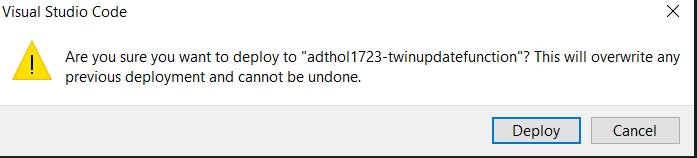

1. When the deployment finishes, you'll be prompted to Start Streaming Logs
  
1. Click on **Stream Logs** to see the Twin Update messages received by the Azure Function.

    - Alternatively, you can Stream Logs at a later time by right-clicking on the Azure Function in VS Code and choosing **Start Streaming Logs**
  

At this point, Azure Digital Twins should be sending the Twin Updates it receives to an Event Hub whose events are processed by the Azure Function.  The Azure Function formats the events and published them to another Event Hub where can be ingested by Time Series Insights.

## Visualize Data using Time Series Insights

### Create a Time Series Insights (TSI) environment

1. The commands below will create a storage account (needed by TSI) and provision the TSI environment

    ```azurecli
    $storage="adtholtsitorage"+(get-random -maximum 10000)
    $tsiname=$random+"tsienv"
    az storage account create -g $rgname -n $storage --https-only -l $location
    $key=$(az storage account keys list -g $rgname -n $storage --query [0].value --output tsv)
    az timeseriesinsights environment longterm create -g $rgname -n $tsiname --location $location --sku-name L1 --sku-capacity 1 --data-retention 7 --time-series-id-properties '$dtId' --storage-account-name $storage --storage-management-key $key -l $location
    ```

1. After the TSI environment is provisioned, we need to setup an event source. We will use the Event Hub that receives the processed Twin Change events

    ```azurecli
    $es_resource_id=$(az eventhubs eventhub show -n tsi-event-hub -g $rgname --namespace $ehnamespace --query id -o tsv)
    $shared_access_key=$(az eventhubs namespace authorization-rule keys list -g $rgname --namespace-name $ehnamespace -n RootManageSharedAccessKey --query primaryKey --output tsv)
    az timeseriesinsights event-source eventhub create -g $rgname --environment-name $tsiname -n tsieh --key-name RootManageSharedAccessKey --shared-access-key $shared_access_key --event-source-resource-id $es_resource_id --consumer-group-name '$Default' -l $location
    ```

1. Finally, configure permissions to access the data in the TSI environment.

    ```azurecli
    $id=$(az ad user show --id $username --query objectId -o tsv)
    az timeseriesinsights access-policy create -g $rgname --environment-name $tsiname -n access1 --principal-object-id $id  --description "some description" --roles Contributor Reader
    ```

### View TSI Data

Now, data should be flowing into your Time Series Insights instance, ready to be analyzed. Follow the steps below to explore the data coming in.

1. Open your instance of [Time Series Insights](https://ms.portal.azure.com/#blade/HubsExtension/BrowseResourceBlade/resourceType/Microsoft.TimeSeriesInsights%2Fenvironments) in the Azure portal
1. Click on Go to TSI Explorer at the top of the page.
  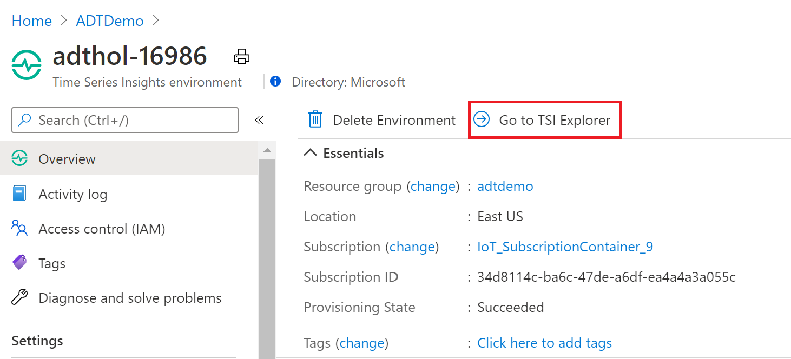
1. In the explorer, you will see one Twin from Azure Digital Twins shown on the left. Select GrindingStep, select Chasis Temperature, and hit add.
    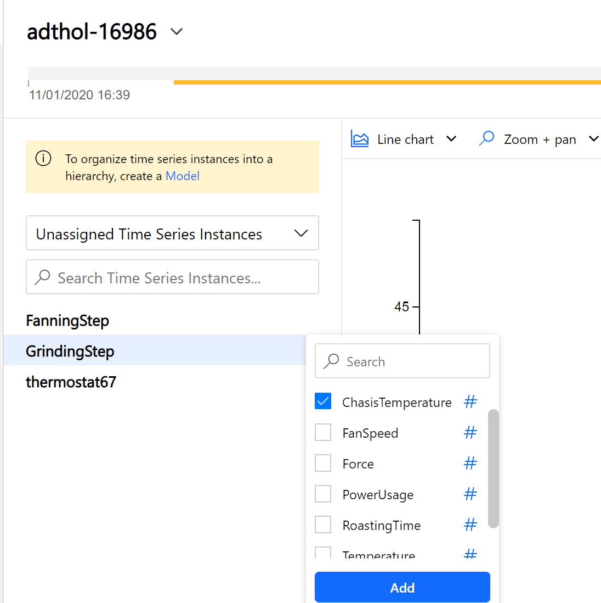

    >[!TIP] If you don't see data:
    >
    > - make sure the simulated client is running:
    > - Check for errors in the  
    > - Check for errors in the 

1. You should now be seeing the Chasis Temperature readings from a device named GrindingStep, as shown below.
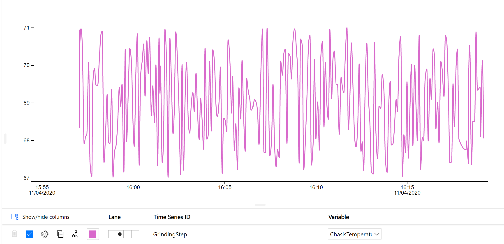

## Challenge: Update Status of Production Line

In the current scenario, the status of the production line is a property in the digital twin.  Think about how the status should be determined and updated using what you've learned.
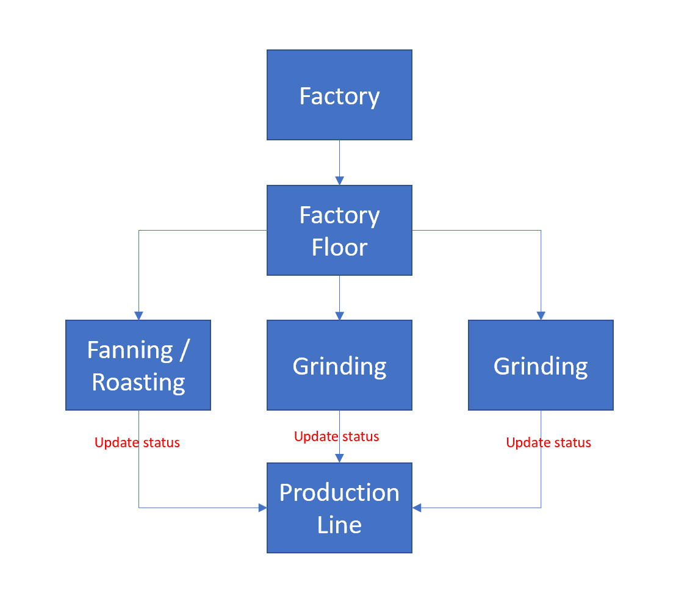

## Visualize Data using PowerBI

PowerBI (PBI) is a powerful tool that can be used for self-service adhoc analytics and to create dashboards that can be shared. In this section, we'll configure a data path that PBI can use and we'll create a simple dashboard.

### PowerBI Workspace

1. Sign in to your [Power BI](https://powerbi.microsoft.com/en-us/) account
1. On the left under `Workspaces` click on `Create a workspace`
1. For `Workspace name` enter `initials-IoTLab` replace `initials` with your initials example: td-IoT Lab


### Configure IoT Hub

1. Create a consumer group so that PBI can have an access to idempotent version of the data. Also, retrieve the SAS key.

    ```azurecli
    az iot hub consumer-group create --hub-name $dtname --name ASA
    ```

### Create, configure, and run a Stream Analytics job

1. Create an Azure Stream Analytics (ASA) job

    ```azurecli
    az stream-analytics job create --resource-group $rgname --name "PBIVisualization" --location $location
    ```
1. In the [Azure portal](https://portal.azure.com), Open the ASA job created

1. Under **Job topology**, select **Inputs**.

1. In the **Inputs** pane, select **Add stream input**, then select **IoT Hub** from the drop-down list. On the new input pane, enter the following information:

   **Input alias**: Enter `IoTHub`

   **Select IoT Hub from your subscription**: Select this radio button.

   **Subscription**: Select the Azure subscription you're using for this lab

   **IoT Hub**: Select the IoT Hub you're using for this lab

   **Endpoint**: Select **Messaging**.

   **Shared access policy name**: Select *iothubowner*

   **Shared access policy key**: This field is auto-filled based on your selection for the shared access policy name.

   **Consumer group**: Select the consumer group you created previously.

   Leave all other fields at their defaults.

1. Select **Save**.

1. Under **Job topology**, select **Outputs**.

1. In the **Outputs** pane, select **Add** and **Power BI**.

1. On the **Power BI - New output** pane, select **Authorize** and follow the prompts to sign in to your Power BI account.

1. After you've signed in to Power BI, enter the following information:

   **Output alias**: Enter `PBI`.

   **Group workspace**: Select the workspace created earlier

   **Dataset name**: Enter IoTDataSet

   **Table name**: Enter IoTData.

   **Authentication mode**: Select `User token`

1. Select **Save**

1. Under **Job topology**, select **Query** and paste the query below

    ```sql
        WITH AnomalyDetectionStep AS
        (
            SELECT
                EVENTENQUEUEDUTCTIME AS time,
                FanSpeed,
                Force,
                ChasisTemperature,
                PowerUsage,
                RoastingTime,
                CAST(Vibration AS float) AS vibe,
                AnomalyDetection_SpikeAndDip(CAST(Vibration AS float), 95, 120, 'spikesanddips')
                    OVER(LIMIT DURATION(second, 120)) AS SpikeAndDipScores
            FROM IoTHub
        )
        SELECT
            time,
            Vibe,
            FanSpeed,
            Force,
            ChasisTemperature,
            PowerUsage,
            RoastingTime,
            CAST(GetRecordPropertyValue(SpikeAndDipScores, 'Score') AS float) AS
            SpikeAndDipScore,
            CAST(GetRecordPropertyValue(SpikeAndDipScores, 'IsAnomaly') AS bigint) AS
            IsSpikeAndDipAnomaly
        INTO PBI
        FROM AnomalyDetectionStep
    ```
1. Click on **Test query** to see the data.  If there's no data, ensure the simulated client is running
1. Select **Save query**.

### Run the Stream Analytics job

In the Stream Analytics job, select **Overview**, then select **Start** > **Now** > **Start**. Once the job successfully starts, the job status changes from **Stopped** to **Running**.

### Create a Power BI report to visualize the data

1. Ensure the simulated client is running

1. Sign in to your [Power BI](https://powerbi.microsoft.com/en-us/) account.

1. On the left, select the workspace **xx-IoTLab** (xx are your initials)

   You should see the dataset that you specified when you created the output for the Stream Analytics job.

1. Next to **IoTDataSet** click on the ellipsis and select **Create Report**

1. Create a line chart to show real-time temperature over time:

   1. On the **Visualizations** pane of the report creation page, select the line chart icon to add a line chart.

   1. On the **Fields** pane, under the **IoTData** table:

       1. Drag **time** to **Axis** on the **Visualizations** pane.

       1. Drag **Chasistemperature** to **Values**.

      A line chart is created. The x-axis displays date and time in the UTC time zone. The y-axis displays ChasisTemperature from the sensor.

1. Create another line chart to show real-time humidity over time. To do this, click on a blank part of the canvas and follow the same steps above to place **EventEnqueuedUtcTime** on the x-axis and **humidity** on the y-axis.
1. On the top right, click on Save and provide a name for the report

### Create a Power BI Dashboard

#### Add a guage

1. On the left, click on **xx-IoTLab**
1. At the top, click on **New** -> **Dashboard**
1. At the top, click on **Edit** -> **Add a tile**.  In the Window that opens
    1. Choose **Custom Streaming Data** and click next
    2. Choose **IoTDataSet** and click next
    1. For **Visualization Type** choose **Guage**
        1. For **Value** choose **Vibe**
    1. click Next and Apply

#### Add a SpikeAndDipScore Clustered Bar Chart Tile

1. At the top, click on **Edit** -> **Add a tile**.  In the Window that opens
    1. Choose **Custom Streaming Data** and click next
    1. Choose **IoTDataSet** and click next
    1. For **Visualization Type** choose **Clustered bar chart**
        1. For **Value** choose **SpikeAndDipScore**
    1. click Next and Apply

#### Add the IsSpikeAndDipAnomaly Card Tile

1. At the top, click on **Edit** -> **Add a tile**.  In the Window that opens
    1. Choose **Custom Streaming Data** and click next
    1. Choose **IoTDataSet** and click next
    1. For **Visualization Type** choose **Card**
        1. For **Value** choose **IsSpikeAndDipAnomaly**
    1. click Next and Apply

#### Add Anomalies Over The Hour Line Chart Tile

Now to create a fourth tile, the `Anomalies Over the Hour` line chart.  This one is a bit more complex.

1. At the top, click on **Edit** -> **Add a tile**.  In the Window that opens
    1. Choose **Custom Streaming Data** and click next
    1. Choose **IoTDataSet** and click next
    1. Under **Visualization Type**, open the dropdown, and then click **Line chart**.
    1. Under **Axis**, click **+ Add value**, and then select **time** from the dropdown.
    1. Under **Values**, click **+ Add value**, and then select **IsSpikeAndDipAnomaly** from the dropdown.
    1. Under **Time window to display**, choose **60** and leave the units set to **Minutes**.

1. To display the Tile details pane, click **Next**

This is the end of the Hands On Lab!